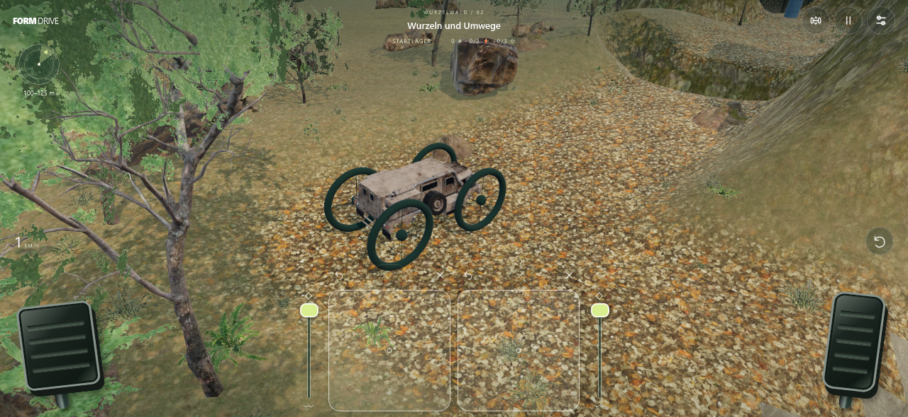
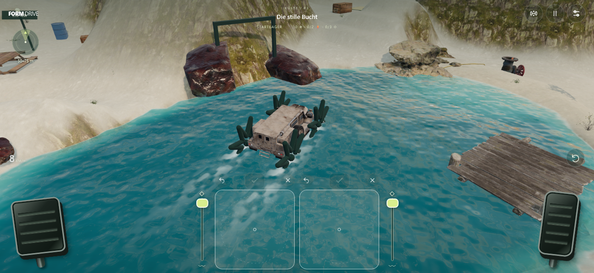

# FORMDRIVE

Zeichne deine Räder, erkunde eine offene Landschaft und löse physische Rätsel. Ein Solo-Abenteuer für das iPhone im Querformat, ohne Zeitlimit, Werbung oder Anmeldung.

**Version 2.0.0 — offene 3D-Welten und mechanische Rätsel.**

[Spiel öffnen](https://derdruckpilot.github.io/draw-wheel-racer/) · [Technik und Grenzen](docs/IMPLEMENTIERUNG.md) · [Prüfbericht](docs/QA-2.0.md) · [Assetquellen](https://derdruckpilot.github.io/draw-wheel-racer/credits.html)





## Spielen

1. Öffne das Spiel in Safari. Über **Teilen → Zum Home-Bildschirm** kannst du es als PWA installieren. Warte beim ersten Start auf **Offline bereit**; die lokal gespeicherten Modelle und Texturen benötigen ungefähr 80 MB Download.
2. Halte das iPhone quer. Zeichne links die Hinterräder und rechts die Vorderräder. Mehrere Striche sind möglich. Erst das jeweilige Häkchen montiert die Form und leert den Entwurf.
3. Rechts Gas geben, links bremsen. Halte die Bremse nach dem Stillstand weiter für den Rückwärtsgang. Weiter oben am Gaspedal drücken gibt mehr Gas; ein Wisch nach oben aktiviert den Tempomat.
4. Aktiviere die Neigungssteuerung im Fahrwerkmenü: rechts/links kippen verlagert Gewicht, vor/zurück kippen lenkt. Kalibriere in deiner normalen Halteposition. Dort stehen auch Touchregler bereit.
5. Die äußeren senkrechten Regler ändern die Steifigkeit der beiden Achsen. Große, kleine, offene und nachgiebige Formen haben unterschiedliche Vor- und Nachteile.

Tastatur: **D / →** Gas, **A / ←** rückwärts, **W / S** lenken, **Q / E** Gewicht, **Leertaste** bremsen, **Esc** pausieren.

## Erkundung und Rätsel

- 21 vollständig neu angelegte Gebiete in Canyon, Wald, Küste, Steinbruch und Gletscher. Geschwungene Wege kreuzen und verzweigen sich; du kannst auch quer durchs Gelände fahren. Es gibt keine unsichtbaren Fahrspurkorridore.
- Das Radar zeigt nur einen groben Zielsektor und eine Entfernungsspanne. Hindernisse, Schalter und der Lösungsweg bleiben verborgen.
- Finde Energiezellen und fahre mit ihnen zu den Generatoren. Erst alle versorgten Generatoren öffnen das Ziellager. Drei zusätzlich versteckte Fundstücke sind optional.
- Druckplatten funktionieren nur unter tatsächlicher Last. Schiebe Kisten, Geröll oder Fässer darauf. Manche Tore benötigen mehrere gleichzeitig gehaltene Signale oder einen bereits versorgten Generator.
- Bedienbare Ventile, ablassbare Becken, gewichtsabhängige Wippen und Hebebühnen verändern erreichbare Wege. Der Aufzug startet erst mit belasteter Platte und aktivierter Bedienung auf der Plattform.
- Niedrige Felspassagen, unregelmäßige Stufen, Querrinnen, steile Hänge, Seen, Schlamm und Eis verlangen unterschiedliche Formen und Fahrmanöver. Zurückfahren und einen anderen Weg suchen gehört dazu.
- Checkpoints stehen unregelmäßig und teils abseits der Wege. Bergen versetzt nur das Fahrzeug zum zuletzt entdeckten Lager. Rätselzustände und Gegenstände bleiben erhalten; Gegenstände in der Nähe lassen sich im Pausenmenü zurücksetzen.
- Ein Stern fürs Ziellager, einer ohne Bergung und einer für alle drei Fundstücke. Alle Gebiete bleiben frei wählbar.

Die frühen Gebiete sind auf etwa 5–10 Minuten Erkundung ausgelegt; Umfang und Mechanikverknüpfungen wachsen. Die tatsächliche Dauer hängt davon ab, wie schnell man Wege und Lösungen entdeckt.

## Umgebung

33 importierte Modellvarianten und neun PBR-Materialsets von Poly Haven (CC0): unterschiedliche Felsen, Bäume, Gras, Farne, Brennnesseln, Sträucher, Baumstümpfe, Totholz, Stege, Kisten, Fässer, Lampen, Generatoren und technische Details. Der Truck stammt aus CesiumJS (Apache-2.0).

Die Landschaft besitzt durchgehende Texturen, räumlich gemischte Fels- und Bodenmaterialien, bewachsene Wegränder, Schatten und eine nahe mitlenkende Kamera. Dezente, verblassende Fahrspuren helfen dabei, kürzlich erkundete Stellen wiederzuerkennen. Staub entsteht an belasteten Rädern auf trockenem Untergrund. Wasser verwendet gemeinsame Wellen für Darstellung und Auftrieb, sichtbare Tiefe, Reflexionen, Uferschaum und formabhängige Spritzer. Matsch besitzt eine langsam bewegte, texturierte Oberfläche; Eis liegt in eigenen Gletschergebieten.

Modelle, Texturen und Lizenzen sind lokal enthalten. GPU-komprimierte Texturen, Instanzen, räumliche Sichtbarkeitsgrenzen und wiederverwendete Radpuffer begrenzen den Aufwand auf Mobilgeräten. Der automatische Grafikmodus kann Auflösung und Schatten anpassen; „Detailreich“ behält die volle Darstellung.

## Spielstände

Version 2 verwendet ein neues Format. Alter Streckenfortschritt wird beim ersten Start entfernt; Ton und Grafikqualität werden übernommen. Neue Fahrten speichern Rätselzustände, Fundstücke, montierte Formen, Gegenstände und das zuletzt gefundene Lager. Nach einem Neustart geht es am Lager weiter.

Browserdaten zu löschen entfernt den Spielstand und den Offlinecache. Ein App-Update wird erst nach Antippen installiert.

## Lokal entwickeln und prüfen

Node.js 24 oder neuer:

```sh
npm ci
npm run dev
npm test
npm run build
npm run preview
```

Für die Browserprüfungen muss der Produktionsbuild auf Port 4173 laufen:

```sh
npx playwright install chromium webkit
npm run test:browser
```

`GAME_URL` kann auf eine andere Vorschau zeigen. Die Tests prüfen unter anderem echte Kontaktlast auf Druckplatten, blockierte Tore, befahrbare Aufzüge, eine lösbare Gegengewichtswippe, Wasserkräfte, Spielstände, geschlossene Ufer, Geländeübergänge, Zeichnen, Pedale, Gyrosensorzustände und Offlineupdates. Die Tests ersetzen keinen Leistungstest auf dem tatsächlichen iPhone 16 Pro Max mit iOS 27.

Die Veröffentlichung erfolgt nach Tests und Build automatisch über den GitHub-Pages-Workflow. Die Assetaufbereitung ist optional; alle Laufzeitdateien sind eingecheckt. Details stehen in [ASSETS.md](docs/ASSETS.md).

Historische `UPDATE-1.*`-Dokumente beschreiben die ersetzte Streckenversion, nicht die aktuelle 3D-Physik.
